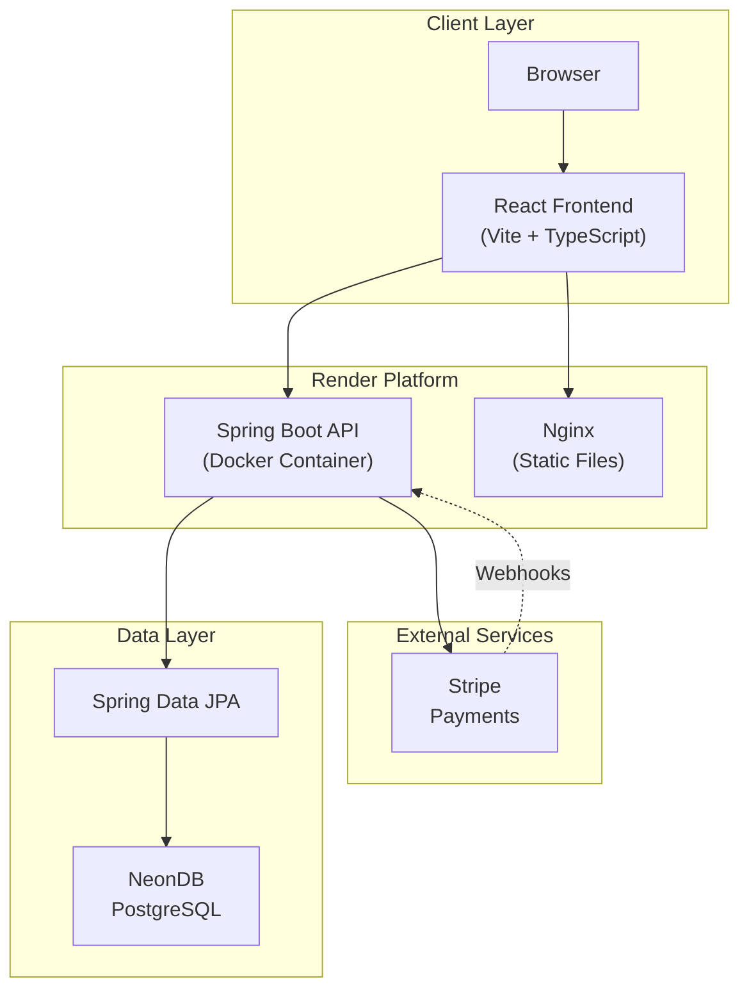
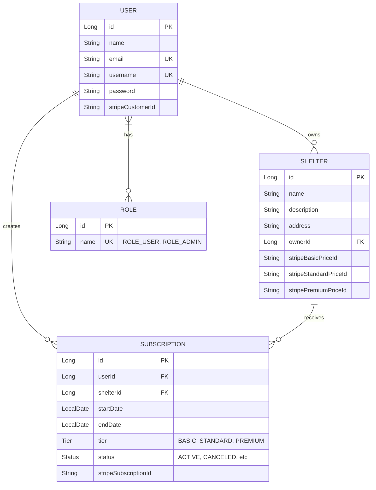
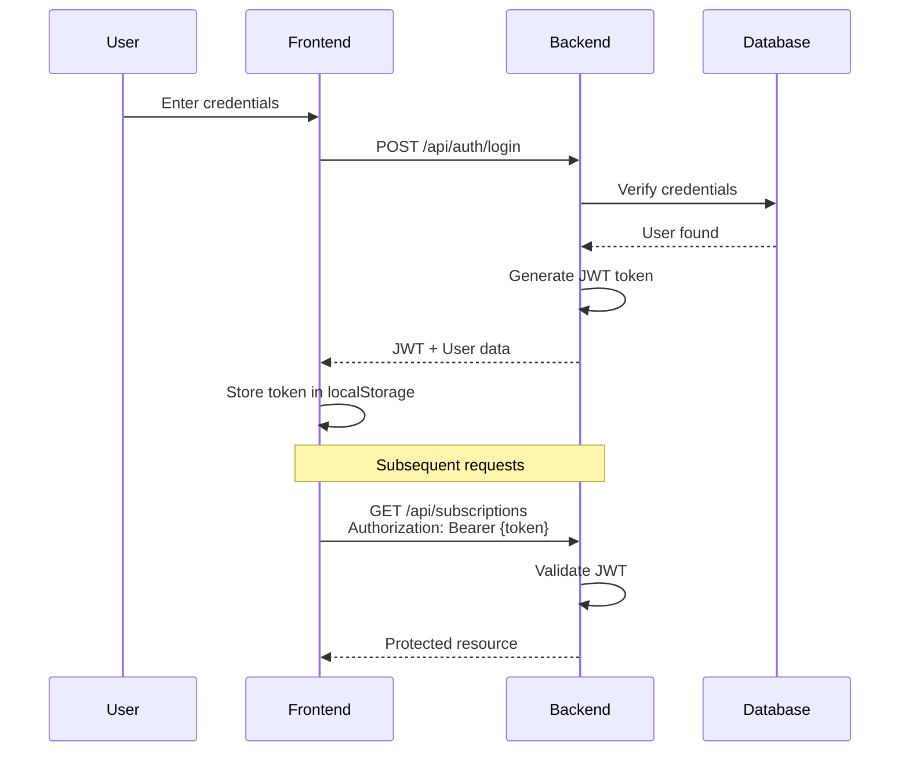
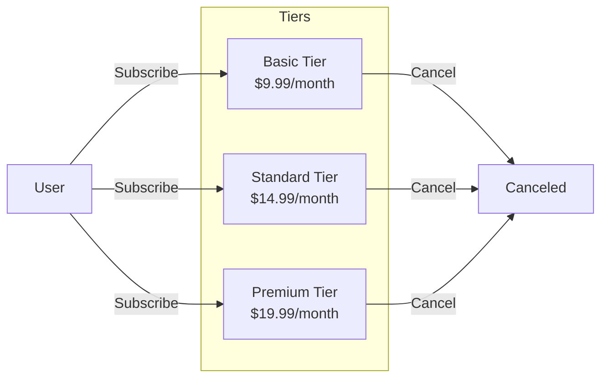
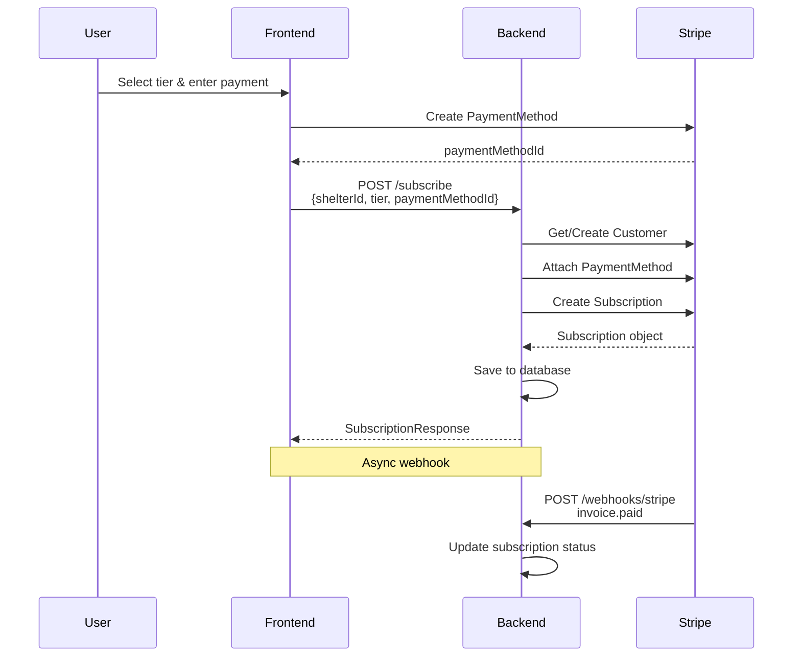
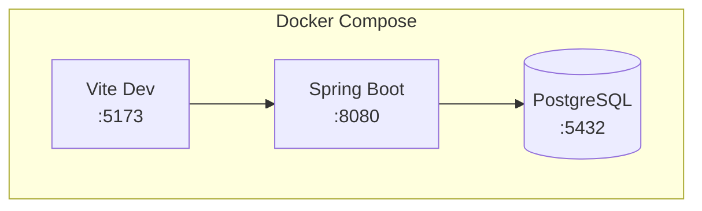

# Fanimal - Architecture Documentation

> **Animal Shelter Subscription Platform** | Spring Boot 3 + React + TypeScript + PostgreSQL + Stripe

---

## Table of Contents

1. [System Architecture](#1-system-architecture)
2. [Database Design](#2-database-design)
3. [API Design](#3-api-design)
4. [Authentication](#4-authentication)
5. [Payments](#5-payments)
6. [Frontend Architecture](#6-frontend-architecture)
7. [DevOps & Deployment](#7-devops--deployment)
8. [Interview Talking Points](#8-interview-talking-points)

---

## 1. System Architecture

### High-Level Diagram



### Design Decisions

| Decision       | Choice                | Rationale                                              |
| -------------- | --------------------- | ------------------------------------------------------ |
| **Backend**    | Spring Boot 3         | Enterprise-grade, excellent ecosystem, JPA integration |
| **Frontend**   | React + Vite          | Fast development, hot reload, TypeScript support       |
| **Database**   | PostgreSQL (Neon)     | Relational data, ACID compliance, serverless scaling   |
| **ORM**        | Spring Data JPA       | Type-safe repositories, built-in pagination            |
| **Auth**       | JWT + Spring Security | Stateless, scalable, industry standard                 |
| **Payments**   | Stripe                | Robust subscription support, webhook reliability       |
| **Deployment** | Docker + Render       | Container isolation, easy scaling, CI/CD integration   |

---

## 2. Database Design

### ER Diagram



### Schema Patterns

| Pattern               | Implementation                             | Purpose                           |
| --------------------- | ------------------------------------------ | --------------------------------- |
| **Soft References**   | `stripeCustomerId`, `stripeSubscriptionId` | Link to external Stripe resources |
| **Enum Types**        | `Tier`, `SubscriptionStatus`               | Type-safe status management       |
| **Many-to-Many**      | `User ↔ Role` via join table               | Flexible role assignment          |
| **Ownership Pattern** | `Shelter.ownerId → User`                   | Shelter belongs to owner user     |

---

## 3. API Design

### Endpoints Reference

| Route                          | Method | Auth   | Purpose                     |
| ------------------------------ | ------ | ------ | --------------------------- |
| `/api/auth/register`           | POST   | None   | User registration           |
| `/api/auth/login`              | POST   | None   | User login, returns JWT     |
| `/api/auth/verify`             | GET    | JWT    | Verify token, get user info |
| `/api/auth/logout`             | POST   | JWT    | User logout                 |
| `/api/shelters`                | GET    | None   | List all shelters           |
| `/api/shelters/{id}`           | GET    | None   | Get shelter by ID           |
| `/api/subscriptions`           | GET    | JWT    | Get user's subscriptions    |
| `/api/subscriptions/subscribe` | POST   | JWT    | Create new subscription     |
| `/api/subscriptions/{id}`      | DELETE | JWT    | Cancel subscription         |
| `/api/webhooks/stripe`         | POST   | Stripe | Handle Stripe webhooks      |

### Request/Response Format

**POST /api/auth/login**

```json
// Request
{
  "username": "john_doe",
  "password": "securepassword123"
}

// Response (200)
{
  "token": "eyJhbGciOiJIUzI1NiJ9...",
  "user": {
    "id": 1,
    "name": "John Doe",
    "email": "john@example.com",
    "username": "john_doe"
  }
}
```

**POST /api/subscriptions/subscribe**

```json
// Request
{
  "shelterId": 1,
  "tier": "STANDARD",
  "paymentMethodId": "pm_1234567890"
}

// Response (201)
{
  "id": 1,
  "startDate": "2026-01-02",
  "tier": "STANDARD",
  "status": "ACTIVE",
  "shelter": { "id": 1, "name": "Happy Paws" },
  "user": { "id": 1, "name": "John Doe" }
}
```

### DTO Pattern

```java
// Separate DTOs for requests and responses
public record RegisterRequest(
    @NotBlank String name,
    @Email String email,
    @NotBlank String username,
    @Size(min = 8) String password
) {}

public record UserResponse(
    Long id,
    String name,
    String email,
    String username
) {
    public static UserResponse fromEntity(User user) {
        return new UserResponse(
            user.getId(),
            user.getName(),
            user.getEmail(),
            user.getUsername()
        );
    }
}
```

---

## 4. Authentication

### JWT Flow



### Security Configuration

```java
// SecurityConfiguration.java
@Bean
public SecurityFilterChain securityFilterChain(HttpSecurity http) throws Exception {
    return http
        .csrf(AbstractHttpConfigurer::disable)
        .cors(cors -> cors.configurationSource(corsConfigurationSource()))
        .exceptionHandling(e -> e.authenticationEntryPoint(authEntryPointJwt))
        .sessionManagement(s -> s.sessionCreationPolicy(SessionCreationPolicy.STATELESS))
        .authorizeHttpRequests(req -> {
            req.requestMatchers("/api/auth/**").permitAll();
            req.requestMatchers("/api/shelters/**").permitAll();
            req.requestMatchers("/api/webhooks/stripe").permitAll();
            req.anyRequest().authenticated();
        })
        .addFilterBefore(authTokenFilter, UsernamePasswordAuthenticationFilter.class)
        .build();
}

@Bean
public CorsConfigurationSource corsConfigurationSource() {
    CorsConfiguration config = new CorsConfiguration();
    config.setAllowedOrigins(List.of(
        "http://localhost:5173",
        "https://fanimal-fui5.onrender.com"
    ));
    config.setAllowedMethods(List.of("GET", "POST", "PUT", "DELETE", "OPTIONS"));
    config.setAllowedHeaders(List.of("Authorization", "Content-Type"));
    config.setAllowCredentials(true);

    UrlBasedCorsConfigurationSource source = new UrlBasedCorsConfigurationSource();
    source.registerCorsConfiguration("/**", config);
    return source;
}
```

### JWT Token Filter

```java
// AuthTokenFilter.java
@Override
protected void doFilterInternal(HttpServletRequest request,
                                 HttpServletResponse response,
                                 FilterChain chain) {
    String token = parseJwt(request);

    if (token != null && jwtUtils.validateJwtToken(token)) {
        String username = jwtUtils.getUsernameFromToken(token);
        UserDetails userDetails = userDetailsService.loadUserByUsername(username);

        UsernamePasswordAuthenticationToken auth =
            new UsernamePasswordAuthenticationToken(
                userDetails, null, userDetails.getAuthorities()
            );

        SecurityContextHolder.getContext().setAuthentication(auth);
    }

    chain.doFilter(request, response);
}
```

---

## 5. Payments

### Subscription Tiers



### Stripe Integration Flow



### Subscription Service

```java
// SubscriptionService.java
public Customer getOrCreateCustomer(UserDetails userDetails) throws StripeException {
    User user = userRepository.findByUsername(userDetails.getUsername())
            .orElseThrow(() -> new ResponseStatusException(NOT_FOUND, "User not found"));

    if (user.getStripeCustomerId() != null) {
        return Customer.retrieve(user.getStripeCustomerId());
    }

    CustomerCreateParams params = CustomerCreateParams.builder()
            .setEmail(user.getEmail())
            .setName(user.getName())
            .build();

    Customer customer = Customer.create(params);
    user.setStripeCustomerId(customer.getId());
    userRepository.save(user);

    return customer;
}

public void unsubscribe(Long id, UserDetails userDetails) throws StripeException {
    Subscription subscription = subscriptionRepository.findById(id)
            .orElseThrow(() -> new ResponseStatusException(NOT_FOUND));

    // Authorization check
    if (!subscription.getUser().getUsername().equals(userDetails.getUsername())) {
        throw new ResponseStatusException(FORBIDDEN, "Unauthorized");
    }

    // Cancel in Stripe
    com.stripe.model.Subscription stripeSub =
        com.stripe.model.Subscription.retrieve(subscription.getStripeSubscriptionId());
    stripeSub.cancel(SubscriptionCancelParams.builder().build());

    // Update local status
    subscription.setStatus(SubscriptionStatus.CANCELED);
    subscriptionRepository.save(subscription);
}
```

---

## 6. Frontend Architecture

### Component Structure

```
frontend/src/
├── components/
│   ├── navigation/          # Header, MobileMenu
│   ├── landing/             # Hero, Features, HowItWorks
│   ├── shelters/            # ShelterCard, ShelterDetails
│   └── subscription/        # SubscriptionForm
│
├── context/
│   ├── AuthContext.tsx      # Authentication state
│   ├── ShelterContext.tsx   # Shelter data
│   └── SubscriptionContext.tsx # Subscription state
│
├── hooks/
│   ├── useShelter.ts        # Shelter fetching
│   └── useAuth.ts           # Auth utilities
│
├── pages/
│   ├── Landing.tsx
│   ├── Shelters.tsx
│   └── ShelterDetails.tsx
│
├── services/
│   └── api.ts               # Axios configuration
│
└── types/
    ├── AuthTypes.ts
    ├── ShelterTypes.ts
    └── SubscriptionTypes.ts
```

### Context Pattern

```typescript
// context/AuthContext.tsx
export interface AuthContextType {
  user: UserType | null;
  token: string | null;
  login: (username: string, password: string) => Promise<void>;
  register: (data: RegisterData) => Promise<void>;
  logout: () => void;
  verify: () => Promise<void>;
  isLoading: boolean;
}

export function AuthProvider({ children }: { children: React.ReactNode }) {
  const [user, setUser] = useState<UserType | null>(null);
  const [token, setToken] = useState<string | null>(() =>
    localStorage.getItem("token")
  );
  const [isLoading, setIsLoading] = useState(false);

  useEffect(() => {
    if (token) {
      verify();
    }
  }, []);

  const login = async (username: string, password: string) => {
    setIsLoading(true);
    try {
      const response = await axiosInstance.post("/auth/login", {
        username,
        password,
      });
      setUser(response.data.user);
      setToken(response.data.token);
      localStorage.setItem("token", response.data.token);
      toast.success("Login successful!");
    } catch (error) {
      toast.error("Login failed");
      throw error;
    } finally {
      setIsLoading(false);
    }
  };

  return (
    <AuthContext.Provider
      value={{ user, token, login, logout, verify, isLoading }}
    >
      {children}
    </AuthContext.Provider>
  );
}
```

### Axios Configuration

```typescript
// services/api.ts
import axios from "axios";

export const axiosInstance = axios.create({
  baseURL: import.meta.env.VITE_BACKEND_URL,
  headers: {
    "Content-Type": "application/json",
  },
});

// Request interceptor - add JWT token
axiosInstance.interceptors.request.use((config) => {
  const token = localStorage.getItem("token");
  if (token) {
    config.headers.Authorization = `Bearer ${token}`;
  }
  return config;
});

// Response interceptor - handle 401
axiosInstance.interceptors.response.use(
  (response) => response,
  (error) => {
    if (error.response?.status === 401) {
      localStorage.removeItem("token");
      window.location.href = "/";
    }
    return Promise.reject(error);
  }
);
```

---

## 7. DevOps & Deployment

### Docker Architecture



### Backend Dockerfile (Multi-stage)

```dockerfile
# Stage 1: Build
FROM maven:3.9.6-eclipse-temurin-21 AS build
WORKDIR /app
COPY pom.xml .
RUN mvn dependency:go-offline -B
COPY src ./src
RUN mvn clean package -DskipTests

# Stage 2: Run
FROM eclipse-temurin:21-jdk-jammy
WORKDIR /app
COPY --from=build /app/target/*.jar fanimal.jar
EXPOSE 8080
ENTRYPOINT ["java", "-jar", "fanimal.jar"]
```

### Frontend Dockerfile (Production)

```dockerfile
# Build stage
FROM node:20-alpine AS build
WORKDIR /app
COPY package*.json ./
RUN npm ci
COPY . .
ARG VITE_BACKEND_URL
RUN echo "VITE_BACKEND_URL=${VITE_BACKEND_URL}" > .env
RUN npm run build

# Production stage
FROM nginx:alpine
COPY --from=build /app/dist /usr/share/nginx/html
EXPOSE 80
CMD ["nginx", "-g", "daemon off;"]
```

### Environment Variables

| Variable                | Location | Purpose                  |
| ----------------------- | -------- | ------------------------ |
| `SPRING_DATASOURCE_URL` | Backend  | PostgreSQL connection    |
| `JWT_SECRET`            | Backend  | JWT signing key          |
| `STRIPE_API_KEY`        | Backend  | Stripe API access        |
| `STRIPE_WEBHOOK_SECRET` | Backend  | Webhook signature verify |
| `VITE_BACKEND_URL`      | Frontend | API base URL             |

---

## 8. Interview Talking Points

### System Design Questions

**Q: How do you handle user authentication?**

> We use JWT-based stateless authentication. When a user logs in, Spring Security validates credentials against BCrypt-hashed passwords in PostgreSQL. On success, we generate a JWT containing the username and expiration. The frontend stores this token in localStorage and includes it in the Authorization header for all protected requests. A custom filter validates the token on each request.

**Q: How do you handle subscription payments?**

> We integrate with Stripe's subscription API. When a user subscribes, we first create or retrieve their Stripe Customer, attach their PaymentMethod, then create a Stripe Subscription. We store the stripeSubscriptionId locally to track status. Stripe webhooks notify us of payment successes/failures so we can update subscription status accordingly.

**Q: Why did you choose Spring Boot over Node.js?**

> Spring Boot provides enterprise-grade features out of the box: dependency injection, transaction management, JPA for database access, and robust security with Spring Security. The strong typing in Java catches errors at compile time. For a payment-handling application, the maturity and security features of Spring were important factors.

### Database Questions

**Q: Explain your database relationships.**

> Users have many-to-many with Roles for flexible permissions. Users own Shelters (one-to-many). Subscriptions link Users to Shelters with subscription metadata (tier, status, dates). This allows users to subscribe to multiple shelters at different tiers.

**Q: Why store Stripe IDs in your database?**

> We store `stripeCustomerId` on User and `stripeSubscriptionId` on Subscription to maintain the link between our entities and Stripe resources. This allows us to retrieve and manage Stripe objects without re-querying by email. It also enables webhook handlers to look up the correct local record when Stripe events arrive.

### Frontend Questions

**Q: How do you manage global state?**

> We use React Context API for authentication and subscription state. The AuthContext provides user data and auth methods throughout the app. On mount, it checks for an existing token and verifies it with the backend. This approach avoids the complexity of Redux while still providing centralized state management.

**Q: How do you handle API errors?**

> We use Axios interceptors. The response interceptor catches 401 errors and redirects to login. For other errors, we display toast notifications using react-hot-toast. Each context method wraps API calls in try-catch and provides appropriate user feedback.

### DevOps Questions

**Q: How does your Docker setup work?**

> We use multi-stage builds for both frontend and backend. The backend builds with Maven then copies just the JAR to a slim JDK image. The frontend builds with Node then copies static files to nginx. Docker Compose orchestrates all three services (db, backend, frontend) with proper networking and environment variable injection.

**Q: How do you handle environment-specific configuration?**

> Environment variables with defaults. In `application.properties`, we use `${VAR:default}` syntax so the app works locally without configuration. In Docker Compose and Render, we inject production values. The frontend uses Vite's env handling with `.env` files and build-time injection.
